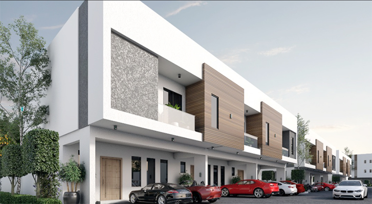
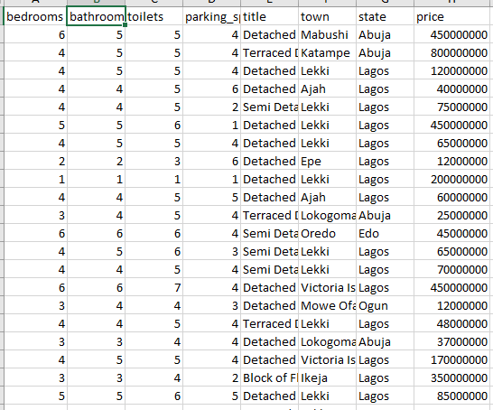
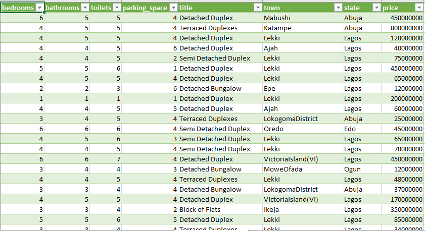
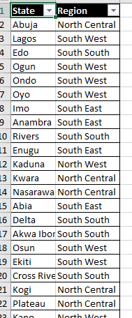
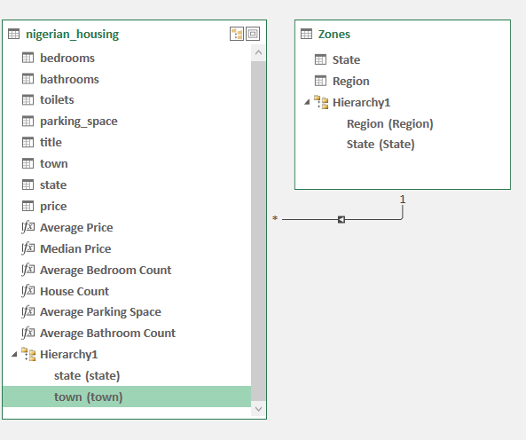
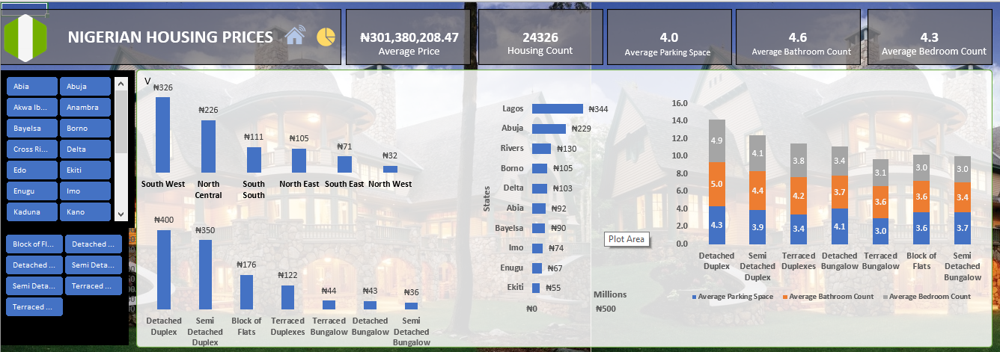

# Nigerian Housing Analysis

## Introduction
Shelter is one of man's basic needs. Alongside, food and clothing, comfortable shelter is what many strive for. Nigerians are not left out and where possible, Nigerians also aim to own theor own homes. However, for many, astronomical costs of homes is a limiting factor. Many factors are thought to determine the cost of a house in Nigeria which include (but are not limited to) location, number of bedrooms, number of bathrooms, parking space, and so on.
This analysis gives an overview of the Nigerian housing market using a simple dataset gotten from kaggle.

**_Disclaimer_**: _All datasets and reports do not represent my company, institution, or country. The dataset used for the creation of this report can be found for free on [Kaggle](https://www.kaggle.com/datasets/abdullahiyunus/nigeria-houses-and-prices-dataset)

## Business Objectives
1.  What's the average cost price for a house in Nigeria?
2.  What's the expected number of bedrooms, bathrooms for a house? How many cars can we expect the parking space to hold?
3.  Houw does the average housing price vary by region?
4.  What's the typical cost for a bungalow (of different types) and a duplex (of different types)
5.  What are the top 10 most expensive cities in terms of housing costs?

## Skills demonstrated:
The following Microsoft Excel skills were incorporated
* Macros 
* Dashboard design 
* Pivot Tables and Pivot Charts
* Filters and Filter design
* Data transformation in Excel Power Query
* Data modelling in Power Pivot
* Measures and DAX (Data Analysis Expressions)

## Data Transformation
This was carried out in Excel Power pivot and it involved performing the following steps:
1.  Ensuring that the datatypes are uniform
2.  Ensuring that the cities were properly represented under their respective states

## Data Modelling
This was performed using the Data modelling tab of Excel Power Pivot. A seperate file named [Zones](Zones.jpg) was imported that contains each states and the regions they fall under. This file was connected to the nigerian housing data file using the state field as the key column. A one-to-many relationship was thus formed.

Raw Data              |         
:--------------------:|

Cleaned Data
:-----------------------:

Zones Data
:-----------------------:

Data Model
:-----------------------:

## Data Analysis and Visualization
The analysis steps were carried out in Excel using Pivot Tables and Pivot charts. The dashboard that was designed can be found and interacted with [here](Analysis.xlsx). This workbook consists of the following sheets:
1.  The Home Page with some interactive buttons for navigation
2.  The Interactive Dashboard
3.  The Raw Data (named Raw Data)
4.  The Transformed Data (named Nigerian houses data)
5.  The Zones data which was used to build the data model
6.  Other sheets containing the Pivot tables and pivot charts

### Home Page:

This page contains a welcome picture as well as two buttons for navigation to:
-  Dashboard
-  Transformed Data

### Dashboard:

This page contains the following:
- title
- the filters
- the various interactive pivot charts
- the navigation buttons close to the dashboard title

## Insights
1.  The average price of a house in Nigeria is a little over NGN300 million for the over 24,000 houses surveyed.
2.  A prospective house buyer in Nigeria can expect 4 bedrooms and 4 bathrooms on average
3.  A prospective house buyer in Nigeria can expect parking space to hold about 4 cars
4.  Houses in the South Western region of Nigeria are the most expensive with an approximate average price of NGN326 million
5.  Houses in the North West region of Nigeria are the least expensive with an approximate average price of NGN32 million
6.  Detached Duplexes cost the most while semi detached bungalows cost the least
7.  Lagos, Abuja and Rivers have the most expensive houses in Nigeria
8.  Houses with more bedrooms and bathrooms are more expensive (although this is a no-brainer)

## Recommendations
1.  Mortgage plans should be introduced for propsective buyers with flexible paying plans which account for eventual loss of Jobs or other means of livelihood of the house buyer.
2.  Prospective house buyers who don't mind relocating should target the South Eastern region as this is not just a major economic hub but also has the least expensive houses

## Limitations of the analysis
Less data was collected for states and cities in the Northern part of the country. In fact, data for states like Taraba, Jigawa, and so on don't exist
This data doesn't account for the econmic metrics of the different states as this will better help prospective buyers assess whether moving to another region due to affordable housing will be worth it in the long run. Also, there was no date/datetime field to represent the dates for which the data was collected which could have helped to observe trends in the prices of houses in Nigeria. Also, some individuals are not interested in buying houses but in renting. However, this dataset doesn't account for houses rented out to tenants.
